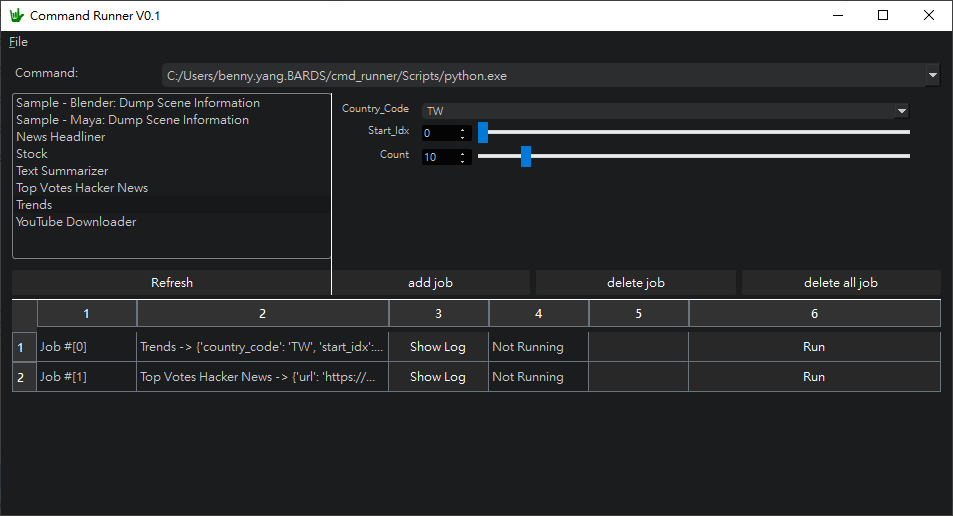

# CommandRunner
CommandRunner is my daily used command execution tool. It helps me to do a lot of batching works easily and able to implement some small handy tools.
With automatically generated user interface or manual defined user interface. This utiltiy provides me a quick way to do many interesing things and exploring a lot of possibilities.




## Use cases
- **Use mayapy or blender batch python mode to run python scripts**
- **Packaging modules into a compact application**
- **Quick functionality validation and exploration**

## Features

- **Graphical User Interface**: Clean and intuitive Qt-based interface for managing commands
- **Extensible Architecture**: Simple plugin system for adding new commands
- **Real-time Output**: Live command output monitoring with dedicated log windows
- **Process Management**: Start, stop, and monitor multiple processes simultaneously

## Installation

1. Clone the repository:
```bash
git clone https://github.com/220225/CommandRunner.git
cd CommandRunner
git submodule update --init --recursive

```

2. Install dependencies:
```bash
pip install -r requirements.txt
```

## Usage

1. Start the application:
```bash
python src/CommandRunnerMain.py
```

2. The main window will show available commands in the left panel and command parameters in the right panel.

3. Select a command from the list and configure its parameters.

4. Click "Add Job" to add the command to the execution queue.

5. Use the "Run" button to execute the command.

6. "Show Log" to view the command output for each processing jobs.

## Adding New Commands

1. Create a new Python file in the `src/Commands` directory.
2. Define a command class that inherits from `CommandBase`.
3. Implement the required methods:
   - `__init__`: Initialize command parameters
   - `run`: Implement the command's execution logic
   - `rebuild_ui` (optional): if needed for customizing the UI

4. Use dataclass field for command parameters, and command parameters UI will auto-generate.
5. Built - in member variables are supported.
    - `label`: The name shown in the UI
    - `tooltip`: Tool tip message
    - `active`: Whether the command is enabled
    - `category`: The category of the command
    - `ui_class`: The user interface class of the command

Example:
```python
from CommandBase import CommandBase
from dataclasses import dataclass, field

@dataclass
class MyNewCommand(CommandBase):
    name = "MyNewCommand"
    tooltip = "Description of what my command does"

    # dataclass fields for command parameters
    param_A: str = field(default="", metadata={"help": "a text edit box"})
    param_B: int = field(default=2, metadata={"help": "a integer slider"})
    param_C: str = field(default="opt_1", metadata={"help": "combo box with opt_1 and opt_2 option", "items": ["opt_1", "opt_2"]})

    def __init__(self):
        super().__init__()

    def run(self, data):
        # Implement command logic
        pass
```

## Project Structure

- `src/`: Main source code directory
  - `Commands/`: Command implementation files
  - `config/`: Configuration files
  - `ui/`: UI-related files and resources
  - `CommandBase.py`: Base classes for commands
  - `CommandExecuter.py`: Command execution logic
  - `CommandRunnerMain.py`: Main application entry point
  - `Core.py`: Core functionality and utilities
  - `Widgets.py`: Qt widget implementations

## License

This project is licensed under the MIT License - see the [LICENSE](LICENSE) file for details.

## Acknowledgments

- Qt for Python (PySide6) for the GUI framework
- Qt.py for Python bindings
- qargparse for argument parsing and automatic UI generation
